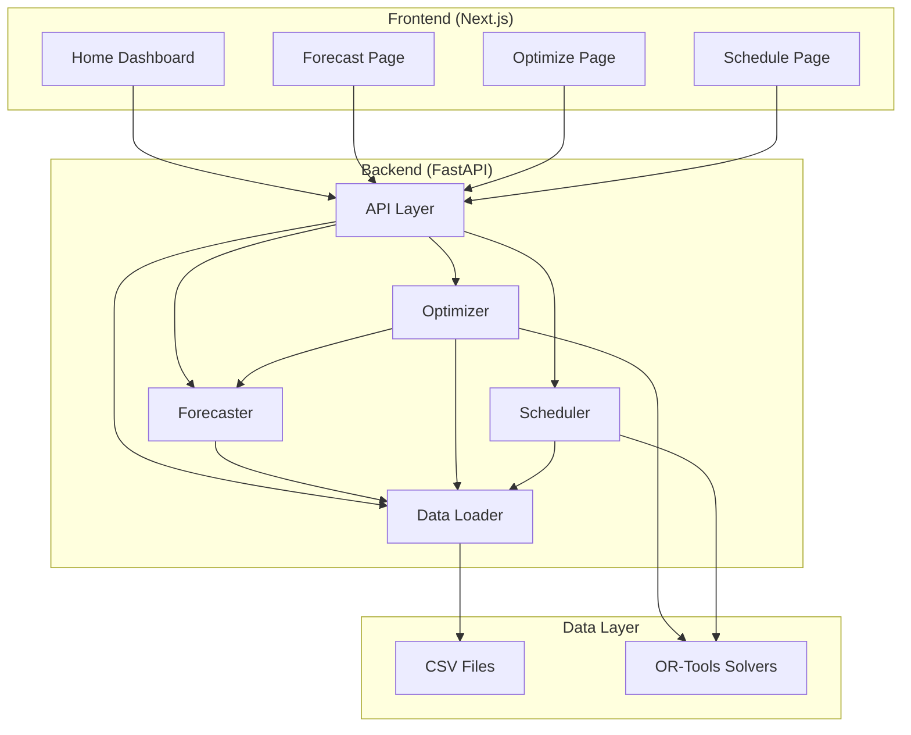

# Design Document

## Overview

LineMind MVP는 3-tier 아키텍처를 기반으로 한 웹 애플리케이션입니다:
- **Frontend**: Next.js + TypeScript + Tailwind CSS + Recharts
- **Backend**: FastAPI + Python
- **Data Layer**: CSV 파일 기반 시드 데이터 + OR-Tools 최적화 엔진

시스템은 점진적 복잡도 증가 원칙을 따릅니다. 각 기능은 먼저 더미(stub) 구현으로 시작하여 전체 플로우를 검증한 후, 실제 최적화 알고리즘으로 대체됩니다.

### 핵심 설계 원칙

1. **단계적 구현**: 더미 → 실제 알고리즘 순서로 구현하여 리스크 최소화
2. **독립적 테스트 가능성**: 각 모듈은 독립적으로 실행 및 테스트 가능
3. **명확한 에러 핸들링**: 모든 실패 지점에서 사용자 친화적 메시지 제공
4. **데이터 기반 설정**: 하드코딩 최소화, CSV로 파라미터 관리

## Architecture

### System Architecture Diagram



### Data Flow

1. **Forecast Flow**: User → Forecast Page → POST /api/forecast/run → SimpleForecaster → Production History CSV → Forecast Results
2. **Optimize Flow**: User → Optimize Page → POST /api/mix/optimize → Optimizer → Forecast Results + Lines CSV + Cost CSV → Mix Plan
3. **Schedule Flow**: User → Schedule Page → POST /api/schedule/run → Scheduler → Mix Plan + Workers CSV → Schedule

## Components and Interfaces

### Backend Components

#### 1. Data Loader (`backend/data_loader.py`)

**Purpose**: CSV 파일 로딩 및 검증을 담당하는 중앙 데이터 접근 계층

**Class: DataLoader**
```python
class DataLoader:
    def __init__(self, data_dir: str = "data/seed")
    def load_csv(self, filename: str, required_columns: list) -> pd.DataFrame
    def load_all_data(self) -> Dict[str, pd.DataFrame]
```

**Key Responsibilities**:
- CSV 파일 존재 여부 확인
- 필수 컬럼 검증
- 결측치(NA) 검증
- 명확한 에러 메시지 제공

**Error Handling**:
- `FileNotFoundError`: CSV 파일 없음
- `ValueError`: 필수 컬럼 누락 또는 결측치 존재
- `pd.errors.EmptyDataError`: 빈 CSV 파일

#### 2. Forecaster (`backend/forecast.py`)

**Purpose**: 생산량 예측 엔진 (Phase 1: Moving Average, Phase 2: Prophet/ARIMA)

**Class: SimpleForecaster**
```python
class SimpleForecaster:
    def __init__(self)
    def moving_average_forecast(self, df: pd.DataFrame, model: str, periods: int = 30) -> pd.DataFrame
    def run_forecast_all_models(self) -> dict
```

**Algorithm**: 
- 최근 7일 이동평균 계산
- 정규분포 노이즈 추가 (std = 평균 * 0.1)
- 신뢰구간: 예측값 ± 20%

**Output Format**:
```python
{
    "status": "success",
    "forecasts": {
        "ModelA": [
            {"date": "2024-01-10", "model": "ModelA", "forecast_units": 125, "conf_lo": 100, "conf_hi": 150},
            ...
        ]
    }
}
```

#### 3. Optimizer (`backend/optimizer.py`)

**Purpose**: 생산 믹스 최적화 (Phase 1: Stub, Phase 2: MILP)

**Phase 1 - Class: StubOptimizer**
```python
class StubOptimizer:
    def __init__(self)
    def simple_line_assignment(self, forecast_data: dict) -> dict
    def run_optimization(self) -> dict
```

**Phase 2 - Class: MilpOptimizer**
```python
class MilpOptimizer:
    def __init__(self)
    def run_optimization(self) -> dict
```

**MILP Model Design**:

**Decision Variables**:
- `Q[l, m, w]`: 라인 l에서 모델 m을 주차 w에 생산하는 수량 (정수)
- `Y[l, m, w]`: 라인 l에서 모델 m을 주차 w에 생산 여부 (불리언)

**Constraints**:
1. 라인당 주간 단일 모델: `Σ_m Y[l,m,w] ≤ 1` for all l, w
2. 생산량-생산여부 연결: `Q[l,m,w] ≤ Y[l,m,w] * capacity[l] * 7`
3. 수요 충족: `Σ_l Q[l,m,w] ≥ demand[m,w]` for all m, w
4. 라인 적격성: `Y[l,m,w] = 0` if m not in eligible_models[l]

**Objective Function**:
```
Minimize: Σ (Q[l,m,w] * production_cost) + Σ (changeover_cost[m1,m2] * changeover_indicator)
```

**Output Format**:
```python
{
    "status": "success",
    "mix_plan": [
        {"period": 1, "line_id": "L1", "model": "ModelA", "planned_units": 1050, "line_utilization": 0.85}
    ],
    "kpi": {
        "total_cost": 1500000,
        "changeovers": 3,
        "changeover_hours": 8,
        "fulfillment_rate": 98.5,
        "estimated_ot": 0
    }
}
```

#### 4. Scheduler (`backend/scheduler.py`)

**Purpose**: 인력 스케줄링 (Phase 1: Greedy Stub, Phase 2: CP-SAT)

**Phase 1 - Class: StubScheduler**
```python
class StubScheduler:
    def __init__(self)
    def run_stub_schedule(self, mix_plan: list) -> dict
```

**Phase 2 - Class: CpsatScheduler**
```python
class CpsatScheduler:
    def __init__(self)
    def run_cpsat_schedule(self, mix_plan: list) -> dict
```

**CP-SAT Model Design**:

**Decision Variables**:
- `x[w, d, s]`: 작업자 w가 날짜 d에 교대 s 근무 여부 (불리언)

**Constraints**:
1. 하루 최대 1교대: `Σ_s x[w,d,s] ≤ 1` for all w, d
2. 주간 최대 근무시간: `Σ_d,s (x[w,d,s] * 8) ≤ max_hours_week[w]` for all w
3. 연속 야간 근무 제한: `Σ_{d'=d}^{d+2} x[w,d','Night'] ≤ 3` for all w, d
4. 최소 휴식 시간: 교대 간 12시간 이상
5. 라인별 필요 인원 충족: `Σ_w x[w,d,s] ≥ required_staff[line,d,s]`

**Objective Function**:
```
Minimize: Σ (x[w,d,s] * wage[w] * 8) + Σ (night_preference_penalty) + Σ (overtime_penalty)
```

**Output Format**:
```python
{
    "status": "success",
    "schedule": [
        {"date": "Week 1, Day 1", "line_id": "L1", "shift": "Day", "worker_id": "W001", "worker_name": "김철수"}
    ],
    "kpi": {
        "total_cost": 5000000,
        "total_ot_hours": 20,
        "night_bias_index": 0.45,
        "fulfillment_rate": 100
    }
}
```

#### 5. API Layer (`backend/app.py`)

**FastAPI Application**

**Endpoints**:
```python
GET  /health                  # Health check
GET  /api/data/status         # Data loading status
POST /api/forecast/run        # Run forecast
POST /api/mix/optimize        # Run mix optimization
POST /api/schedule/run        # Run scheduling (body: mix_plan)
```

**CORS Configuration**:
```python
allow_origins=["http://localhost:3000"]
allow_methods=["*"]
allow_headers=["*"]
```

**Error Response Format**:
```python
{
    "status": "error",
    "message": "Detailed error message",
    "suggestion": "Try relaxing constraints"  # Optional
}
```

### Frontend Components

#### 1. Home Dashboard (`frontend/src/app/page.tsx`)

**Purpose**: 메인 대시보드 및 네비게이션 허브

**Features**:
- 3개 기능 카드 (예측, 믹스, 스케줄링)
- 워크플로우 진행 상황 Progress Bar
- 핵심 KPI 4개 카드 (Phase 2)
- API 연결 상태 표시

**State Management**:
```typescript
const [currentPage, setCurrentPage] = useState<'home' | 'forecast' | 'optimize' | 'schedule'>('home')
```

#### 2. Forecast Page (`frontend/src/components/ForecastPage.tsx`)

**Purpose**: 생산량 예측 실행 및 시각화

**Features**:
- "예측 실행" 버튼
- 모델별 라인 차트 (예측값, 상한, 하한)
- 요약 통계 (평균, 기간, 총량)
- "이 결과로 믹스 최적화" 버튼 (Phase 2)

**State**:
```typescript
const [forecasts, setForecasts] = useState<{[model: string]: ForecastData[]}>({})
const [loading, setLoading] = useState(false)
const [error, setError] = useState<string | null>(null)
```

**Chart Library**: Recharts
- `LineChart`, `Line`, `XAxis`, `YAxis`, `CartesianGrid`, `Tooltip`, `Legend`

#### 3. Optimize Page (`frontend/src/components/OptimizePage.tsx`)

**Purpose**: 생산 믹스 최적화 실행 및 시각화

**Features**:
- "최적화 실행" 버튼
- KPI 카드 4개 (총 수요, 계획 생산, 충족률, 예상 비용)
- 모델별 생산 비중 파이 차트
- 라인별 계획 바 차트
- 상세 계획 테이블
- "이 계획으로 스케줄링" 버튼 (Phase 2)

**State**:
```typescript
const [mixPlan, setMixPlan] = useState<MixPlan[]>([])
const [kpi, setKpi] = useState<KPI | null>(null)
```

**Charts**:
- `PieChart` for model distribution
- `BarChart` for line plans

#### 4. Schedule Page (`frontend/src/components/SchedulePage.tsx`)

**Purpose**: 인력 스케줄링 실행 및 시각화

**Features**:
- "스케줄링 실행" 버튼
- KPI 카드 (총 인건비, OT 시간, 야간 편중 지수)
- 스케줄 테이블 (날짜, 라인, 교대, 작업자)
- 캘린더 뷰 (Phase 2 optional)

**State**:
```typescript
const [schedule, setSchedule] = useState<ScheduleItem[]>([])
const [kpi, setKpi] = useState<ScheduleKPI | null>(null)
```

## Data Models

### CSV Data Schemas

#### production_history.csv
```
date: YYYY-MM-DD
line_id: string (L1, L2, L3)
model: string (ModelA, ModelB, ModelC)
shift: string (Day, Night)
produced_units: integer
target_units: integer
```

#### lines.csv
```
line_id: string
eligible_models: comma-separated string
hours_per_shift: integer (default: 8)
shifts_per_day: integer (default: 2)
base_daily_capacity: integer
```

#### workers.csv
```
worker_id: string (W001, W002, ...)
name: string
years: integer (experience years)
wage_per_hour: integer (KRW)
max_hours_week: integer
prefer_night: boolean
```

#### cost_params.csv
```
from_model: string
to_model: string
changeover_hours: integer
changeover_cost: integer (KRW)
```

### API Data Models

#### ForecastData
```typescript
interface ForecastData {
    date: string
    model: string
    forecast_units: number
    conf_lo: number
    conf_hi: number
}
```

#### MixPlan
```typescript
interface MixPlan {
    period: number
    line_id: string
    model: string
    planned_units: number
    line_utilization: number
}

interface MixKPI {
    total_demand: number
    total_planned: number
    fulfillment_rate: number
    total_cost?: number
    changeovers?: number
    changeover_hours?: number
}
```

#### Schedule
```typescript
interface ScheduleItem {
    date: string
    line_id: string
    shift: string
    worker_id: string
    worker_name: string
}

interface ScheduleKPI {
    total_cost: number
    total_ot_hours: number
    night_bias_index: number
    fulfillment_rate: number
}
```

## Error Handling

### Backend Error Handling Strategy

**1. Data Loading Errors**
- CSV 파일 없음 → `{"status": "error", "message": "CSV 파일이 없습니다: {filepath}"}`
- 필수 컬럼 누락 → `{"status": "error", "message": "필수 컬럼이 없습니다: {missing_cols}"}`
- 결측치 존재 → `{"status": "error", "message": "데이터에 결측치가 있습니다"}`

**2. Solver Errors**
- 솔버 없음 → `{"status": "error", "message": "SCIP solver unavailable."}`
- 해 없음 → `{"status": "error", "message": "No optimal solution found.", "suggestion": "Try relaxing constraints"}`
- 타임아웃 → `{"status": "error", "message": "Solver timeout.", "suggestion": "Reduce problem size or increase timeout"}`

**3. API Errors**
- 모든 엔드포인트는 try-except로 감싸서 500 에러 방지
- 예외 발생 시 `{"status": "error", "message": str(e)}` 반환

### Frontend Error Handling Strategy

**1. API Call Errors**
```typescript
try {
    const response = await fetch(url, options)
    const data = await response.json()
    if (data.status === 'error') {
        setError(data.message)
        if (data.suggestion) {
            setError(`${data.message}\n제안: ${data.suggestion}`)
        }
    }
} catch (err) {
    setError('API 호출 실패. 백엔드 서버를 확인하세요.')
}
```

**2. User Feedback**
- 에러 메시지는 빨간색 박스로 표시
- 로딩 중에는 버튼 비활성화 및 "실행중..." 텍스트 표시
- 성공 시 결과 즉시 표시

## Testing Strategy

### Backend Testing

**1. Unit Tests**
- `test_data_loading()`: 각 CSV 로드 및 검증 테스트
- `test_forecast()`: 예측 알고리즘 출력 형식 검증
- `test_optimizer()`: 최적화 결과 제약 조건 만족 여부 검증
- `test_scheduler()`: 스케줄 제약 조건 만족 여부 검증

**2. Integration Tests**
- 전체 플로우 테스트: 데이터 로드 → 예측 → 최적화 → 스케줄링
- API 엔드포인트 테스트: 각 엔드포인트 호출 및 응답 검증

**3. Manual Testing Checklist**
- 각 STEP의 체크리스트 항목 수동 검증
- 브라우저에서 UI 동작 확인

### Frontend Testing

**1. Component Testing**
- 각 페이지 컴포넌트 렌더링 테스트
- 버튼 클릭 시 API 호출 확인
- 에러 상태 표시 확인

**2. E2E Testing (Manual)**
- 홈 → 예측 → 최적화 → 스케줄링 전체 플로우
- 뒤로 가기 버튼 동작
- 차트 렌더링 확인

### Test Data

**Seed Data Requirements**:
- 최소 3일 이상의 생산 이력
- 3개 라인, 3개 모델
- 5명 이상의 작업자
- 모든 모델 간 체인지오버 비용 정의

## Implementation Phases

### Phase 1: Foundation (STEP 0-3)
- 프로젝트 구조 및 Hello World
- 데이터 로딩 시스템
- 기본 예측 (Moving Average)
- 더미 믹스 최적화

**Goal**: 전체 플로우가 동작하는 것을 확인

### Phase 2: Real Optimization (STEP 4-5)
- MILP 믹스 최적화
- 더미 스케줄링

**Goal**: 실제 최적화 알고리즘 적용

### Phase 3: Advanced Scheduling (STEP 6-7)
- CP-SAT 스케줄링
- 워크플로우 통합 및 에러 핸들링

**Goal**: 제약 조건을 고려한 완전한 스케줄링

### Phase 4: Polish (STEP 8-9)
- 대시보드 및 UI/UX 개선
- 문서화 및 제출 준비

**Goal**: 프로덕션 레디 상태

## Technology Stack

### Backend
- **Framework**: FastAPI 0.100+
- **Language**: Python 3.9+
- **Data Processing**: pandas, numpy
- **Optimization**: OR-Tools (SCIP, CP-SAT)
- **Server**: uvicorn

### Frontend
- **Framework**: Next.js 14+ (App Router)
- **Language**: TypeScript
- **Styling**: Tailwind CSS
- **Charts**: Recharts
- **HTTP Client**: fetch API

### Development Tools
- **Version Control**: Git
- **Package Management**: pip (backend), npm (frontend)
- **IDE**: VS Code (권장)

## Deployment Considerations

**For MVP Demo**:
- Backend: `uvicorn app:app --host 0.0.0.0 --port 8000`
- Frontend: `npm run dev` (port 3000)
- No database required (CSV files)
- No authentication required

**Future Enhancements** (Out of Scope for MVP):
- PostgreSQL for persistent storage
- Redis for caching forecast results
- Docker containerization
- Authentication & authorization
- Real-time updates via WebSocket
- Prophet/ARIMA for advanced forecasting
