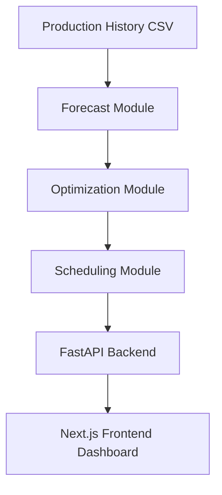

# LineMind 🚀

**AI-powered Production Forecasting & Scheduling Platform**

LineMind is an MVP project that connects **demand forecasting → production mix optimization → workforce scheduling** into a single pipeline.  
It helps manufacturers minimize overtime and labor costs while maximizing production efficiency.

---

## 🌟 Features
- 📊 **Forecasting**: Time-series demand prediction for multiple car models (A/B/C).
- ⚙️ **Production Mix Optimization**: OR-Tools based MILP solver to allocate models across shared production lines with changeover costs.
- 👷 **Workforce Scheduling**: Automatic shift assignment minimizing overtime & cost, considering workers' seniority.
- 📑 **KPI Dashboard**: Visualize production plans, schedules, and cost metrics.

---

## 🏗 Architecture


---

## 📂 Project Structure
```
linemind/
  backend/            # FastAPI services
    services/         # Forecast / Optimize / Schedule modules
    routers/          # API endpoints
    data/seed/        # Sample CSVs
  frontend/           # Next.js + Tailwind frontend
    pages/            # Dashboard, Forecast, Mix, Schedule
    components/       # UI components
```

---

## ⚡ Tech Stack
- **Frontend**: Next.js, TailwindCSS, Chart.js  
- **Backend**: FastAPI, OR-Tools, Prophet/LightGBM  
- **Database**: SQLite (MVP), PostgreSQL (scaling)  
- **Deployment**: Vercel (FE), Fly.io/Render (BE)  

---

## 🚀 Quickstart
### 1. Clone Repo
```bash
git clone https://github.com/<your-username>/linemind.git
cd linemind
```

### 2. Backend Setup
```bash
cd backend
pip install -r requirements.txt
uvicorn app:app --reload
```

### 3. Frontend Setup
```bash
cd frontend
npm install
npm run dev
```

---

## 📊 Sample Data
| date       | line_id | model | shift | produced_units |
|------------|---------|-------|-------|----------------|
| 2025-09-01 | L1      | A     | day   | 120            |
| 2025-09-01 | L1      | B     | night | 80             |

Seed CSV files are under `/backend/data/seed/`.

---

## 📑 Roadmap
- [ ] Add baseline forecasting (Prophet)  
- [ ] Implement production mix optimizer (OR-Tools)  
- [ ] Worker shift scheduling (CP-SAT)  
- [ ] Frontend KPI dashboard  
- [ ] Export results as CSV/PDF  

---

## 🤝 Contributing
Pull requests are welcome. For major changes, please open an issue first to discuss what you would like to change.  

---

## 📜 License
MIT License © 2025 LineMind Team
